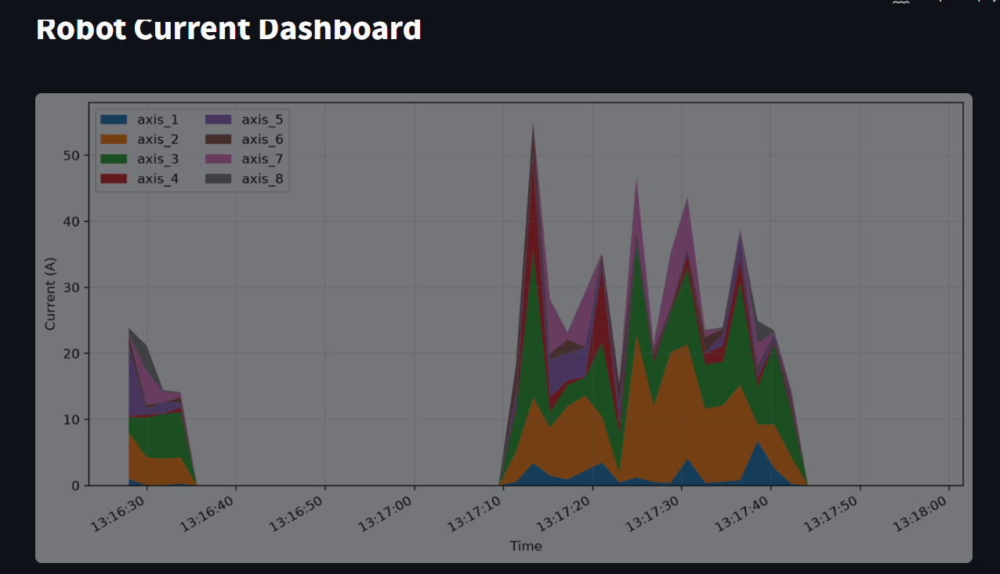

# Group 6
## Jasper Lim
-repo init
-orchestra
-web_ui-interface

## Alamir Ibrahim
-neon integration
-data_collection-agent
-database_service_agent

## Ved Vishal Patel
-not present



Our Dashboard interface in action.

`DataStreamVisualization_Workshop_Group_6.ipynb` contains the original streaming workshop. `lab.ipynb` documents the predictive-maintenance regression workflow and how to run the current dashboard.

## Predictive Maintenance Dashboard

The interactive Streamlit dashboard uses RMBR4-2 as the baseline and RMBR4-3 or RMBR4-4 as synthetic test scenarios. It fits a separate scikit-learn linear regression from elapsed time to current for each of axes 1–8, reports chronological holdout metrics and coefficients, plots observed readings and regression predictions with Plotly, and shows residuals and sustained events.

Run it from the repository root:

```powershell
.\.venv\Scripts\python.exe -m streamlit run src\web_ui\web_ui_interface.py
```

The defaults are MinC at the 95th percentile and MaxC at the 99th percentile of positive residuals from the baseline's final 20% calibration window, with a five-second persistence requirement. All three settings can be adjusted in the dashboard. Thresholds are per-axis and expressed in the dataset's current units; the CSVs do not provide a kWh conversion. Detected events can be downloaded as a structured CSV.

Choose **Live Neon readings** to monitor the configured database table (`rmbr4_export_data` by default). Set `DATABASE_URL` in the ignored project-root `.env` file; optionally set `ROBOT_DATA_TABLE` to a simple table name. This view refreshes every two seconds and queries the last 90 seconds of readings.

The supplied data is intended for learning and the time-only linear models are not validated failure predictors. Check the holdout R² before interpreting predictions; negative values indicate that the linear time trend performed worse than a constant-mean baseline for that held-out period.